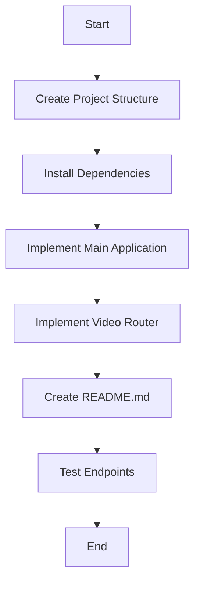

# FastAPI Video Recording API Implementation Plan

## 1. Project Structure

We'll create the following structure for the `final_backend` folder:

```
final_backend/
├── app/
│   ├── __init__.py
│   ├── main.py         # Main FastAPI application
│   └── routers/
│       ├── __init__.py
│       └── video.py    # Video-related endpoints
├── requirements.txt    # Dependencies
└── README.md           # Documentation
```

## 2. Dependencies

We'll need the following dependencies:
- FastAPI: For creating the API
- Uvicorn: For serving the API
- Python-time: For implementing the pause functionality

## 3. API Implementation

### Main Application (`main.py`)
- Set up the FastAPI application
- Include routers
- Configure CORS if needed
- Set up basic error handling

### Video Router (`video.py`)
- Implement the `start_record` endpoint (POST)
  - Return `{"success": true}` to indicate recording has started
- Implement the `process_video` endpoint (POST)
  - Add a 2-second pause using `time.sleep(2)`
  - Return `{"success": true}` to indicate processing is complete

## 4. Documentation

Create a README.md file with:
- Project description
- Installation instructions
- Usage examples
- API documentation

## 5. Testing

- Manual testing of both endpoints using tools like curl, Postman, or the built-in FastAPI Swagger UI

## Implementation Flow Diagram



## API Endpoints Flow

```mermaid
sequenceDiagram
    participant Client
    participant FastAPI
    participant StartRecord
    participant ProcessVideo
    
    Client->>FastAPI: POST /start_record
    FastAPI->>StartRecord: Handle request
    StartRecord-->>FastAPI: Return {"success": true}
    FastAPI-->>Client: Response
    
    Client->>FastAPI: POST /process_video
    FastAPI->>ProcessVideo: Handle request
    Note right of ProcessVideo: Wait for 2 seconds
    ProcessVideo-->>FastAPI: Return {"success": true}
    FastAPI-->>Client: Response